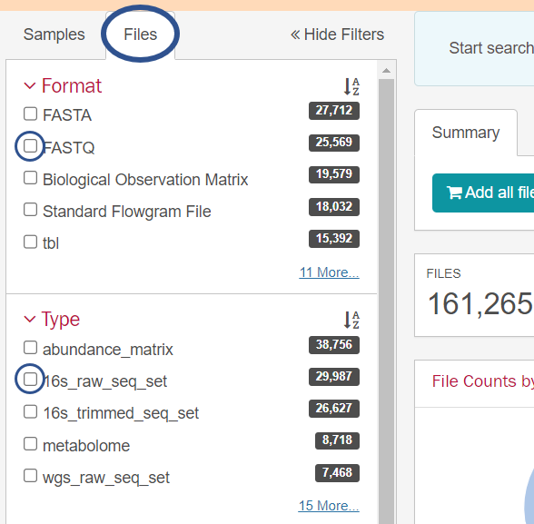
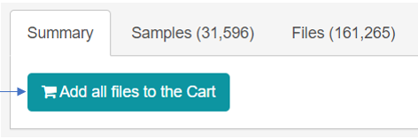
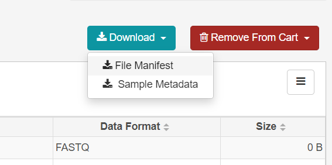

# Microbiome Framework

This is a framework to download fastq files (using [portal_client](https://github.com/IGS/portal_client)) from [HMP Data Portal](https://portal.hmpdacc.org/) containing 
16s rRNA raw sequence data and then process them. The framework uses [mothur](https://mothur.org/) to process the data and generate tables of counts of the number 
of 16s rRNA genes that are affiliated with different operational taxonomic units (OTUs). Lastly, we
use [idability](http://huttenhower.sph.harvard.edu/idability) to build and evaluate hitting-set-based metagenomic codes
in order to analyze personalized codes from microbiome data and evaluate the performance of re-identifying subjects.

**Table of Contents**
* [Installation](#installation)
  + [Linux](#linux)
  + [Windows](#windows)
* [Example of use](#example-of-use)
  + [Create files for download and metadata](#create-files-for-download-and-metadata)
  + [Download files](#download-files)
  + [Decompress files](#decompress-files)
  + [Clean files (optional)](#clean-files-optional)
  + [Postprocess](#extract-taxonomy)
  + [Idability](#mothur-setup)
    + [Evaluation](#evaluation)


## Installation
We provide a `requirements.txt` which includes all the libraries and packages necessary to run the framework.
Run the following command to install all the dependencies:
```
pip install -r requirements.txt
```

### Linux
You need to change parameters in the `src/mothur_files/mothur_config.json` if you are using Linux. Change the `linux_path` 
value to the path were mothur is installed. For example, if you have mothur installed in `/usr/local/bin/mothur-1.46.1`, this is 
the value that you should store. This framework only supports mothur version 1.46.1.

### Windows
If you run the application on a Windows machine, the mothur version 1.46.1. is automatically download and extracted.

## Example of use

### Create files for download and metadata
Through [HMP Data Portal](https://portal.hmpdacc.org/) two files can be generated: a file with download information and one with metadata of the samples. To download the files needed to work with this framework following steps should be followed:
This framework was only tested with **paired-end reads of 16S rRNA sequences** provided in a `.fastq` format.

1. Visit the [portal website](https://portal.hmpdacc.org/) and click Data to get to
the samples dashboard
2. Filter files in Files Tab View:
    - Format: FASTQ
    - Type: 16s_raw_seq_set

    

    Everything else can be filtered by interest e.g. body site. The website provides additional filters e.g. visit number (by pressing "Add filter" in the Samples Tab)
3. Click "Add all files to the Cart" button

   

4. Click on Cart (right top corner)
5. Click on the Download Drop Down Button and download "File manifest" file and "Sample Metadata" file. Both files are needed for the framework to work properly. The files need to be created on the same selection of samples. 

    

Then save both files into one folder `input_dir` and use the following command so the files for later download and metadata files are created:
```
python main.py create <input_dir>
```
Example use:
```
python main.py create hmp_portal_files/feces_moms-pi_fastq
```

Per default the files for download are created for the first two visits. To increase the number of visits use the `--num-visits` flag.
```
python main.py create <input_dir> --num-visits <num_visits>
```

Example use:
```
python main.py create hmp_portal_files/feces_moms-pi_fastq --num-visits 5
```
This command will create all files needed to download the first 5 visits of the feces samples of the moms-pi study. Per default, the folder with the files for download is called `download` and the folder with metadata of the samples is called `metadata`.


### Download files
After creating the .tsv files that are needed for download, we can run the following command to download the .tar files of samples.
```
python main.py download <download_dir>
```

Example use after previous example use command, the files with the download information are saved into folder `/download`:
```
python main.py download download
```

The framework uses [portal_client](https://github.com/IGS/portal_client) to download the files which after downloading can be found in the `data` folder with the following structure.
```
data
└───<body-site_study-name>
    └───visit1
    |   file1.tar
    |   file2.tar
    |   file3.tar
    └───visit2
    |   file1.tar
    |   file2.tar
    |   file3.tar
```

**Attention:** The files downloaded are quite big depending on the amount of samples (up to 30GB only in the compressed state or even more). Make sure to have enough disk space.

**Tip**: To run commands in the background use the `nohup` command in combination with `&`. The output is then rediredted to a file `nohup.out`. We recommend redirected the output of different processes to different files to inspect errors.
```
nohup python main.py download download &
```
or
```
nohup python main.py download download > download_output.txt &
```

### Decompress files
After downloading, all files are double compressed as .gz files in .tar files. To decompress all downloaded files run:
```
python main.py decompress <data_dir>
```

Example use after previous example use command was run:
```
python main.py decompress data
```

**Again attention:** The files downloaded are quite big (up to 200-300 GB), make sure to have enough disk space.

If files are not unzipped by the framework, you can unzip them manually by running the following shell commands:
```
for i in *.tar; do tar -xvf $i; done
for i in *.gz; do gzip -vd $i; done
```

### Clean files (optional)
After decompressing, disk space can get quite full. Run this command to remove no longer needed .tar and .gz files.
Be aware that if you did not run decompress before, you will delete the data that you downloaded.

```
python main.py clean <data_dir>
```

Example use after previous example use command was run:
```
python main.py clean data
```

### Extract Taxonomy
We implemented the process as describes in the original HMP paper ([Supplementary Information](https://www.nature.com/articles/nature11234#Sec8), 16S data processing).

#### Mothur setup
We added the possibility to change two parameters in the mothur config file (`src/mothur_files/mothur_config.json`). These parameters are:
- `processors`: number of processors to use, if you are using multiple processors and the programm crashes, 
try running the command with `processors=1`, the more processors you use the more memory is required. It can increase the speed of the process
but can also lead to out of memory errors during this step.
- `cutoff`: Per default mothur uses to 80% confidence treshold `cutoff=80` which mirrors the original implementation in the Wang paper and the general approach to using 80% confidene in bootstrap values for phylogenetics
f you set `cutoff=0`, classify.seqs will return a full taxonomy for every sequence, regardless of the bootstrap value for that taxonomic assignment.

The command for running mothur includes the following flags:
```
python main.py extract-taxonomy <data_dir> <output_dir> --reclassify --rerun
```
`rerun`: will rerun the entire application (otherwise folders that contain the processed files will be skipped).
`reclassify`: will only rerun the `classify.seqs` step using existing files (otherwise will be skipped).

Example use after previous example use command was run:
```
python main.py extract-taxonomy data
```
Per default the output directory will be `mothur_output`.

### Postprocess
After extracting the taxonomy, the output of mothur is postprocessed to create a file that contains the relative abundance for each sample.
```
python main.py postprocess extract-taxonomy <data_dir> <output_dir>
```

Example use after previous example use command was run:
```
python main.py postprocess mothur_output
```

After running this step, final files will be saved to `\final_data` per default.

### Idability
The paper ["Identifying personal microbiomes using metagenomic codes"](https://www.pnas.org/doi/10.1073/pnas.1423854112) by Franzosa et al. shows that using hitting sets based on
metagenomic codes can be used to match samples to subjects. A hitting set is a set of metagenomic features which can uniquely
identify a subject, in the paper also refered to as metagenomic codes. This is done via the idability script. It automatically uses the first visit file, to create
the genomic codes. The output is saved to `/idability_output` folder. The subfolder `codes` contains the genomic codes
and the subfolder `eval` contains the idability output with the confusion matrix. For checking, we added True Negatives (TN)
to the confusion matrix. The TN are samples that do not appear in the first visit.
```
python main.py idability <data_dir>
```

Example use after previous example use command was run:
```
python main.py idability final_data
```

#### Evaluation
The original paper uses a confusion matrix where the classes can be identified as follows:
- **True Positive (TP)**: A sample was correctly matched, meaning two different visits were matched to the same person.
- **False Negative**: A previous extracted code does not match the same sample anymore.
- **False Positive**: One code matches multiple samples. All samples that are not the original sample are false positives.

Some public datasets provide different sample lists that only partly overlap including a new class:
- **True Negative**: A sample that does not have a match because it was not included in the initial dataset that was used
to create the codes.

 Source: "Identifying personal microbiomes using metagenomic codes" by Franzosa et al.

## Processed Data
The processed data that was obtained with this framework can be found in the `finished_data` folder. 
A more detailed description can be found in the README.md file in the folder.
